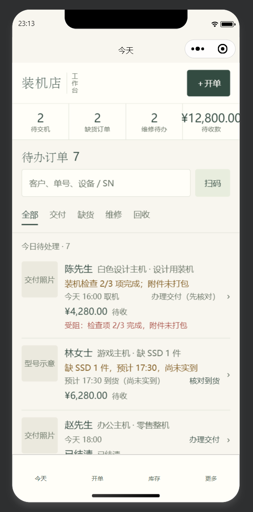

# T02b · 小程序壳与契约回写

日期：2026-09-17
状态：**本地通过（契约、类型、单元、结构自检、类名自检）· 排版层已对齐设计稿并在模拟器实拍确认（§12 / §14）· 新增 1 个待修缺陷（统计条金额溢出）· 详情页渲染与真机仍未验**
提交：`887b267`
依据：[05-implementation-tasks.md · T02b](../../plans/2026-09-17-web-wechat-plan/05-implementation-tasks.md)、[02 UI 规格 §4](../../plans/2026-09-17-web-wechat-plan/02-ui-specification.md)、[02 §2 页面地图](../../plans/2026-09-17-web-wechat-plan/02-ui-specification.md)

本卡建立小程序独立项目、原生 tabBar 四项、列表与详情的真实页面跳转，并回写契约的生成物目标状态。**未连接生产、未写任何业务数据、未新增数据库迁移、未部署、未上传微信**。跨卡片未决项见 [docs/OPEN-ITEMS.md](../../OPEN-ITEMS.md)。

---

## 1. 本卡文件范围

| 类型 | 路径 | 说明 |
|---|---|---|
| 新增 | `miniprogram/project.config.json` | 项目配置：`miniprogramRoot` 取项目根、TS 编译插件、打包忽略清单。初版为 `touristappid`（无 AppID 模式），**2026-09-17 补入真实 AppID `wx1b14bf01ef71718d`**，见 §11 |
| 新增 | `miniprogram/app.json` | 主包四页、原生 tabBar 四项、分包 `packages/sales` |
| 新增 | `miniprogram/app.ts` / `app.wxss` | 入口与设计变量（`--mp-*`，单位换算为 rpx） |
| 新增 | `miniprogram/sitemap.json` | 全部 disallow |
| 新增 | `miniprogram/tsconfig.json` / `package.json` | 类型检查配置、脚本与类型依赖 |
| 新增 | `miniprogram/pages/{today,sales,inventory,more}/index.*` | 主包四页（每页 ts / wxml / wxss / json） |
| 新增 | `miniprogram/packages/sales/order-detail/index.*` | 事项详情（分包页面，真实页面跳转目标） |
| 新增 | `miniprogram/features/demo-data.ts` | V1 演示样本、指标、演示排序、逾期判断 |
| 新增 | `miniprogram/features/amount-view.ts` | 金额格式化与五种呈现形态的口径 |
| 新增 | `miniprogram/features/display-text.ts` | 详情页主标题的设备简称切分（视觉修订，§12.3） |
| 新增 | `miniprogram/templates/landing.wxml` | 三个域落地页共用的排版模板 |
| 新增 | `miniprogram/contracts/generated/`（6 个） | 端内契约生成物，来源 `contracts/generated` |
| 新增 | `miniprogram/scripts/sync-contracts.mjs` | 生成物落地与三方防漂移 |
| 新增 | `miniprogram/scripts/check-pages.mjs` | 结构自检：app.json 注册 ↔ 磁盘文件 |
| 新增 | `miniprogram/scripts/check-classes.mjs` | 结构自检：wxml 类名 ↔ 样式定义（§12.3） |
| 新增 | `miniprogram/tests/*.test.mjs`（3 个） | 样本 ↔ 契约一致性、金额口径、简称切分，共 **32 用例**（初版 26，视觉修订 +6） |
| 新增 | `miniprogram/README.md` | 项目职责、运行方式、已实现 / 未实现、硬性约束 |
| 修改 | `contracts/v1/fixtures.json` | 回写 `dtoGeneration.targets` 两端状态为 `done`，新增 `revisions`（T02b-rev1） |
| 修改 | `contracts/tools/generate-dto.mjs` | manifest 的 `targets` 改为从 fixtures 读取（原先硬编码，见 §6 问题 1） |
| 修改 | `contracts/generated/manifest.json`、`frontend/src/contracts/generated/manifest.json` | 重新生成后的产物（其余 5 个生成物内容未变） |

未触碰 `backend/`、未新增迁移、未运行 `wrangler`、未访问线上数据、未上传小程序。
`frontend/src/` 下唯一变化是生成物 `manifest.json`（重新同步所致），**源码一行未改**。

---

## 2. 结构与跳转

主包四页与原生 tabBar（依据 02 §4 第 93 行「原生 tabBar 使用今天、开单、库存、更多，选中森林绿」）：

| tabBar | 页面 | 主要动作 |
|---|---|---|
| 今天 | `pages/today/index` | 四项统计、事项筛选、竖向任务列表 → 跳详情 |
| 开单 | `pages/sales/index` | 域落地页（入口均为未接通说明） |
| 库存 | `pages/inventory/index` | 域落地页 |
| 更多 | `pages/more/index` | 账本 / 售后 / 回收置换 / 设置入口 |

分包（依据 02 §2 页面地图的 `packages/sales/order-detail`）：事项详情，**真实页面跳转**，底部固定金额与动作条，无 tabBar。

跳转与返回恢复（02 §4「返回和跨端状态」）：

- 列表 → 详情用 `wx.navigateTo`，**只传 `taskId`**，详情重新取数，不把列表旧对象当可提交依据；
- ＋开单 用 `wx.switchTab` 进入开单域（tabBar 页不能用 `navigateTo`）；
- 今天页 `onShow` **刻意不做任何 `setData`**：navigateTo 返回与 switchTab 切回都复用同一页面实例，筛选与滚动位置由框架保留。任何后续改动若在 `onShow` 重置列表，都会破坏这条体验，改动时必须先看该处注释。

---

## 3. 验证证据（实际运行）

执行环境：Windows，Node v22.22.2，命令在项目根执行。

| 检查 | 命令 | 结果 |
|---|---|---|
| 契约总校验 | `node contracts/tools/validate-contracts.mjs` | ✅ **3047 项通过，退出码 0**（与 T01c / T02a 相同） |
| 生成物幂等 | `node contracts/tools/generate-dto.mjs --check` | ✅ 一致（6 个文件） |
| 小程序端防漂移 | `node miniprogram/scripts/sync-contracts.mjs --check` | ✅ 6 个文件与 `contracts/v1` 一致 |
| 网页端防漂移（回归） | `node frontend/scripts/sync-contracts.mjs --check` | ✅ 6 个文件一致 |
| 两端生成物逐字节比对 | 逐文件 `cmp` | ✅ 6/6 完全相同 |
| 小程序单元测试 | `npm --prefix miniprogram test` | ✅ **2 文件 / 26 用例全通过** |
| 小程序类型编译 | `npm --prefix miniprogram run typecheck`（`tsc --noEmit`） | ✅ 通过（strict + noUnusedLocals） |
| 小程序结构自检 | `npm --prefix miniprogram run check-pages` | ✅ 主包 4 页 + 分包 1 页，注册与磁盘一致 |
| 网页端单元测试（回归） | `npm --prefix frontend run test` | ✅ 6 文件 / 50 用例全通过（与 T02a 基线一致） |
| 网页端构建（回归） | `npm --prefix frontend run build` | ✅ `tsc -b && vite build` 通过 |
| 网页端代码检查（回归） | `npm --prefix frontend run lint` | ⚠️ 39 项（35 error / 4 warning），与 T00 基线完全相同，未新增 |
| 微信开发者工具编译 | `cli.js open --project miniprogram` | ❌ **未运行** —— 工具服务端口关闭，见 §7 |
| 真机 / iOS / Android | — | ❌ **未运行** —— 无 AppID，且无真机条件 |

### 测试覆盖的真实断言（26 项）

- **样本 ↔ 契约**（15 项）：逐字段与 `fixtures.datasets.V1.tasks` 相等（字段顺序不计）；条数与 `expected.taskTotal` 一致；`DEMO-` 前缀；taskId / entityId 唯一；固定演示日期取自契约；四项指标与 `metrics` 一致；类别计数与 `expected.categoryCounts` 一致；待收按 `countsTowardReceivable` 重算；契约列出的三笔排除项（维修初估 480、回收未收购 1,500、未定收费）不得计入；金额恒等式；禁用动作必须有可读 blocker；排序可复现且不改原集合；无截止时间的排在最后；`findTaskById` 命中与未命中；逾期分支（**V1 无逾期样本，本项构造用例**）。
- **金额口径**（11 项）：千分位与两位小数；负数保留负号；不吞掉「分」；待收形态与明细；**结清要提醒确认实物交出**；**应付不得显示成负尾款**；**初估要标「预计」且不计确定应收**；**未定价写「待确认」，不得用 ¥0 冒充**；无金额记录不虚构金额；禁用动作给出可读原因。

### 防漂移闸门（三次负向测试，全部如期失败）

| 注入 | 期望 | 实际 |
|---|---|---|
| 手改端内生成物 `objects.ts`（`customerDisplay` → `customerDisplayX`） | 防漂移脚本报错 | ✅ 退出码 1，同时报「端内内容与契约不一致」与「端内与 contracts/generated 不一致」 |
| 改端内样本 `balanceCents: 428000` → `428001` | 测试失败 | ✅ **3 项失败**（字段比对、待收重算、金额恒等式） |
| 改契约侧 V1 `totalCents` 628000 → 628001 | 测试失败 | ✅ 3 项失败（与上一条叠加） |

注入备份放 `.validation-t02b/`（已被 `.gitignore` 覆盖），验证后已删除并复验 26/26 通过、无残留。

---

## 4. 关键决定与理由

**D1 · `miniprogramRoot` 取项目根，让契约路径原样成立。**
契约声明小程序端生成物路径为 `miniprogram/contracts/generated`，并留了「按实际 `miniprogramRoot` 调整并回写」的说明。另一种做法是把源码放 `miniprogram/src/`、生成物留在项目根，但那样小程序源码要跨出 `miniprogramRoot` 引用生成物 —— 微信编译链不处理根目录外的 TS 文件，会直接失败。故取项目根为 `miniprogramRoot`，并回写 `status: done`，**未改动任何 `rootPath`**。
代价：生成物会进小程序包体（6 个文件约 64KB 源码量级）。已在 `packOptions.ignore` 排除 `manifest.json` 与脚本目录；是否进一步优化留待分包体系成型后评估。

**D2 · 两个端各留一份 `sync-contracts.mjs`，不合并成带 `--target` 的脚本。**
契约的 `dtoGeneration.targets` 本就是「每端一个落地目标」的声明；合并会让「改一端要动另一端已通过的产物」。两份脚本各自做「契约 → 中立生成物 → 端内」三方比对，边界清晰。这是设计选择，不是重复代码。

**D3 · 金额格式化不用 `toLocaleString`。**
小程序 JSCore（iOS JavaScriptCore / Android V8）的 Intl 支持不完整，`toLocaleString('zh-CN', …)` 在不同机型可能给出不同的千分位结果甚至静默去分组。金额显示错误属业务事故，故改为纯字符串运算；`tests/amount-view.test.mjs` 断言其与电脑端显示格式一致。

**D4 · 小程序端不引入衬线字体。**
02 §1 要求「只在页标题、设备名和少量大金额使用衬线」，但 02 §1 同时写明小程序「优先系统字体，标题衬线在不同系统可能回退；先验证实际设备，再决定是否引入获授权的子集字体」。本卡按后者执行，统一使用系统字体栈，不引入来源不明的字体。**待真机验证后再定是否引入。**

**D5 · tabBar 不配图标，用系统导航栏。**
原生 tabBar 的 `iconPath` 是可选项。首版用纯文字 tabBar，避免引入授权状态不明的图标素材（AGENTS.md 要求资源注明来源与授权核实状态）。02 §4 要求的「选中森林绿」用 `selectedColor: #334B42`（02 §1 的 ink / primary，其用途明确包含「选中强调」）实现。

**D6 · 四项统计在小程序上两行两列。**
02 §4 写「统计在宽屏四列，320px 或大金额时允许两行两列；不把 ¥128,000.50 缩成极小字号或省略成无法核账的数」。手机不是宽屏，故取两行两列，`¥12,800.00` 保持可读。

**D7 · 未接通的入口只说明，不跳转、不返回假结果。**
与网页端 T02a 的 D4 同一口径。域落地页明确列出「未接通（归属任务卡）」，`＋开单` 只切到开单域（不再伪造四个入口），搜索与待收款指标弹口径说明。

**D8 · 详情页的「阶段」与「事件记录」留空并如实说明，不编造进度。**
V1 读模型样本里没有阶段序列与事件字段（`objects.json` 的 stateMachines 有定义，但样本未提供实例状态）。规格没写的不能自己编（OPEN-ITEMS §2），故该区域只显示一行说明并标归属任务，不画假进度条、不显示推测状态。

**D9 · 契约 `targets.status` 两处一并回写。**
`web` 的实际落地已在 T02a 完成、`miniprogram` 由本卡完成，事实都清楚，一次修订解决 OPEN-ITEMS 的 T-01 与 T-02 两项，避免只改一半造成新的不一致。按契约规则留 `revisions` 记录（T02b-rev1），未提 `contractVersion`——未改任何字段名、类型、枚举取值、动作编号、错误码、金额公式或样本数值，`rootPath` 也未变。

---

## 5. 契约修订（T02b-rev1）

`contracts/v1/fixtures.json`：

- `dtoGeneration.targets[id=web].status`：`pending` → `done`，补 `landedNote`；
- `dtoGeneration.targets[id=miniprogram].status`：`pending` → `done`，`pathNote` 改为记录实际落地方式（`miniprogramRoot` 取项目根，路径与规划值一致）；
- 新增 `revisions` 数组与 T02b-rev1 记录（本文件原先没有 `revisions`，格式对齐 `objects.json`）。

**顺带修掉的生成器缺陷**：`contracts/tools/generate-dto.mjs` 原先把 `targets` 硬编码在 `manifest` 里（`{ id: 'web', …, status: 'pending' }` 等两行字面量），那是与 `fixtures.json` 并存的手写副本，改契约不会反映到 manifest。现改为从 `fixtures.json` 读取，使 `targets` 保持单一来源。改动后 `manifest.json` 内容随契约变化，已在两端重新生成并复验。

---

## 6. 本卡发现的问题

### 问题 1 · 生成器把生成物目标硬编码（已修，属真实缺陷）

`manifest.json` 的 `targets` 不是从契约读的，而是在生成器里写死两行字面量，且状态永远停在 `pending`。这类「第二份手写副本」会让契约声明与生成物静默分叉。修法与 T02a 修生成器导入过滤同一思路：**改生成器，不手改生成物**。

### 问题 2 · 详情页由三类事项共用（有意为之，但属与页面地图的偏差）

02 §2 的页面地图里，售后详情是 `packages/service/detail`（T12）、回收详情是 `packages/recovery/detail`（T14），销售详情才是 `packages/sales/order-detail`。V1 样本的七个事项含 `service_order` 与 `recovery_order`，本卡只有一个详情页，三类都跳它。

**这不是最终形态**：售后与回收的详情内容（维修方案、验机与估价）差异很大，必须分开。归属 T12 / T14，届时按页面地图拆包并改跳转。本卡不自行宣布为最终形态。

### 问题 3 · 「阶段」与「事件记录」无样本可依（未实现，已登记）

见 D8。V1 样本的 `TaskReadModel` 没有状态字段与事件数组，故详情页顶部只有「单号 / 类别 / 交期」，没有「单据状态」。这是**读模型缺字段**，不是页面漏做；`objects.json` 的状态机定义齐备，缺的是样本实例与读模型字段，归 T08 / T18。

### 问题 4 · 逾期分支无样本（沿用 G-14）

02 §4 要求「逾期明确写已逾期，不能只变红」，V1 七条没有逾期项。实现已按固定演示日期比较写好并由单测构造用例覆盖，但**演示数据下不会渲染出该形态**，所以「逾期在真机上的可读性」仍未验。需要补一条逾期样本才能做界面验收。

### 问题 5 · 测试必须用 Node 类型擦除跑 TS，带来两条约束（已修，需记住）

- Node 22 的类型擦除可直接加载 `.ts`，但**不解析无扩展名的相对导入**。因此被测试引用的模块（`demo-data.ts`、`amount-view.ts`）只能有 `import type`，不能有值导入。原本放在 `utils/format.ts` 的格式化函数因此并入 `amount-view.ts`，`utils/` 目录已删除。
- `node --test <目录>` 在本机不工作（会被当成单个文件执行并报 `MODULE_NOT_FOUND`），必须写成 `node --test "tests/*.test.mjs"`。npm script 已按此写法。

### 问题 6 · 新版 TypeScript 移除了 `moduleResolution: node`

`tsc --noEmit` 首次运行报 `TS5108: Option 'moduleResolution=node10' has been removed`。改为 `bundler`（配合 `module: ESNext`，允许无扩展名导入，符合小程序编译习惯）。

### 问题 7 · 契约 WXSS 变量名不能沿用网页端（沿用 P-06 教训）

网页端变量挂在 `.app-shell` 上，小程序没有该选择器，变量定义在 `page` 上。两端是独立编译链，没有共享前提，故小程序端统一用 `--mp-` 前缀，不复用 `wb-`。

---

## 7. 未运行 / 未覆盖（不得当作通过）

| 项 | 状态 | 原因 / 缺口 |
|---|---|---|
| 微信开发者工具编译（「小程序必须编译出原生页面」） | ⚠️ **部分证据** | 2026-09-17 22:52 用户开启服务端口并登录后，已实际驱动工具：AppID 被识别（`√ Using AppID: wx1b14bf01ef71718d`）、项目被加载、22:55:51 日志出现 `restart appservice compile` → `create webview done` → `reload` 且**无页面级编译错误**。但**未取得渲染截图**，不能等同于 02 §188 的截图验收 —— 全过程见 §13。→ **T02b-rev2 取得了更强的证据**：`cli.js preview` 实际编译通过（AppID 正确识别、无编译错误，并首次拿到体积 总 77.4KB / 主包 68.5KB / 分包 9.0KB），见 [rev2 §5](../2026-09-17-T02b-rev2/README.md) |
| 真机 / iOS / Android | **未运行** | AppID 已于 2026-09-17 补入（见 §11），但真机调试仍需工具登录 + 手机端确认；本机无真机条件 |
| 视觉验收：320 / 375 / 390 / 430 宽度、字体放大、对比度 | **部分运行** | 今天页已在模拟器实拍确认（**§14**），并发现统计条金额溢出（缺陷 1）；**该缺陷已由 T02b-rev2 修复，但修复后的形态尚未实拍**。其余宽度档、字体放大、对比度、详情页仍未验 |
| 对比度实测（`danger` 是 02 §1 新增语义色） | **未运行** | 需实际渲染环境 |
| 断网 / 写超时 / 登录过期 / 无权限等界面状态（02 §7） | **未实现** | 无服务端；本卡只有演示数据源 |
| 「返回恢复」的滚动位置 | **只做了不破坏，未做实测** | 实现上 `onShow` 不重置状态即由框架保留；需在真机或工具里滚动后往返验证 |
| 分包体积与主包上限 | **未测** | 需工具构建产物报告；本卡生成物约 64KB 源码量级 |
| 旧深链 / 分享路径直接进入详情 | **未实现** | 需 T03（登录恢复目标）与 T18 |

---

## 8. 待裁定与未决

| 编号 | 事项 | 归属 |
|---|---|---|
| T-01 / T-02 | 两端生成物目标状态回写 | ✅ **本卡已解决**（见 §5） |
| D-C / Q04 | 六导航与 tabBar 是否按权限隐藏、用哪个权限码 | **待负责人裁定**（规格未定义；本卡四项全部可见） |
| D-E | 演示样本进了生产构建产物 | **仍未处理**；小程序端同样受约束（`features/demo-data.ts` 必须在 T18 删除） |
| G-11 / G-12 | 供应商页面归属、SN 台账是否单列导航 | 库存域落地页已如实标注为「待定」，未自行裁定 |
| G-14 | 缺逾期样本 | 见 §6 问题 4 |
| 新增 | 售后 / 回收详情是否立即拆包 | 建议 T12 / T14 处理，不在本卡扩大范围 |
| **Q-T02b-1** | 小程序视觉对齐范围（用户 2026-09-17 提供效果图） | ✅ **已裁定：先对排版层**，当日完成，见 §12 |
| **Q-T02b-2** | 详情页的阶段序列与检查项 | **仍待裁定**：是否新增契约对象并扩 V1 样本；归属 T08 / T12 / T14 |

---

## 9. 复现命令

```bash
# 契约（唯一来源 → 中立生成物 → 两端端内生成物）
node contracts/tools/validate-contracts.mjs        # 应 3047 项、退出码 0
node contracts/tools/generate-dto.mjs
node frontend/scripts/sync-contracts.mjs
node miniprogram/scripts/sync-contracts.mjs
node frontend/scripts/sync-contracts.mjs --check
node miniprogram/scripts/sync-contracts.mjs --check

# 小程序端
npm --prefix miniprogram install
npm --prefix miniprogram test            # 26 用例
npm --prefix miniprogram run typecheck
npm --prefix miniprogram run check-pages

# 网页端回归
npm --prefix frontend run test           # 50 用例
npm --prefix frontend run build
npm --prefix frontend run lint           # 既有 39 项失败，非本卡引入
```

**开发者工具（需先开启服务端口并重启工具）**：

```bash
cd "D:\Software\微信web开发者工具"
node.exe cli.js islogin                                    # 确认已扫码登录
node.exe cli.js open --project "C:\Users\wuerl\Documents\工作同步\pc-quote\miniprogram"
```

导入本目录后，工具应显示四个 tabBar 与一个分包详情页。AppID 已配置（见 §11），因此支持真机调试与上传；代价是**打开项目需要登录**，且该微信号须是小程序 `wx1b14bf01ef71718d` 的开发者或管理员 —— 无 AppID 的免登录预览模式不再可用。

---

## 10. 下一步

- **补齐本卡唯一缺口**：重启开发者工具 → 扫码登录 → 用 CLI 打开 `miniprogram/` 抓真实编译结果，把 §7 第一行从「未运行」改为实际结论。
- **T02c**：提取跨端组件（TaskRow / DeviceSummary / ProgressSteps / AmountActionBar / Feedback）。注意 02 §T02c 要求「不共享 React 组件给微信」，两端各自实现、共用契约与口径。
- **T03 / T04** 可并行推进；T03 仍需微信平台条件（OPEN-ITEMS T-05：**AppID 已到**，主体 / 成员 / API 域名 / 对象存储仍待提供）。
- 开 T18 前必须解决 D-E：两端都不得把演示样本打进生产产物。
- **视觉对齐待裁定（Q-T02b-1）**：用户提供的效果图见 §11.2，范围确定前不动样式。

---

## 11. 补充记录 · AppID 与设计稿对照（2026-09-17 22:40）

### 11.1 AppID 已配置

`miniprogram/project.config.json` 的 `appid`：`touristappid` → **`wx1b14bf01ef71718d`**（用户提供）。

| 项 | 变化 |
|---|---|
| 打开项目 | 需登录，且微信号须为该小程序的开发者 / 管理员。**无 AppID 的免登录预览模式不再可用** |
| 新增能力 | 真机调试、上传体验版（前提：工具已登录且服务端口已开） |
| 本卡结论 | **不改变 §7 的判断** —— 编译仍未运行，卡点是服务端口，不是 AppID |

### 11.2 设计稿对照结论

用户提供的两张效果图，即 `docs/design/2026-09-17-style-exploration/v3/` 下的 `hybrid-desktop.png`（桌面首页）与 `hybrid-mobile-board.png`（手机首页 + 详情对照，898×1055）。

**先分清依据等级**：

- 02 §188 明确写着：小程序需生成**真实开发者工具 / iOS / Android 截图**并注明系统栏尺寸，**不能拿 mobile-review.html 截图代替**。故该效果图是**视觉方向参考，不是验收标准**。
- v3 README 亦声明该原型「待用户评审，**不把它记成已最终批准的设计**」。

**① 配色层无需返工**——v3 的 9 个变量与 `app.wxss` 的 `--mp-*` 逐一对齐（同源于 02 §1）：

| v3 | 小程序 | 值 |
|---|---|---|
| `--paper` | `--mp-paper` | `#f8f6ef` |
| `--ink` | `--mp-ink` | `#334b42` |
| `--muted` | `--mp-muted` | `#687365` |
| `--line` | `--mp-line` | `#d9ddd0` |
| `--sage` | `--mp-sage` | `#e8edde` |
| `--photo` | `--mp-photo` | `#ece9de` |
| `--amber` / `--amber-bg` | `--mp-warning` / `--mp-warning-bg` | `#826021` / `#f1e9d2` |
| `--white` | `--mp-surface` | `#fffef9` |
| `--serif` | 未引入 | 见 D4 |

差异项：v3 有 `--serif`（本卡按 D4 不引入）；小程序多 `--mp-danger`（02 §1 的新增语义色，v3 未用到）。

**② 结构层差距**（范围见 Q-T02b-1）：

| 位置 | 设计稿 | 现状 | 类型 |
|---|---|---|---|
| 列表品牌区 | 「装机店」+ 竖排「工作台」 | `装机店工作台` + `演示门店` | 排版 |
| 列表标题行 | 「待办订单 07」+【订单处理｜设备看板】 | 「待办事项」+「N 项」 | 排版 + 控件 |
| 列表分组 | 「今日待处理 · 7」 | 无 | 排版 |
| 列表行 | 副标题一行「交付检查待完成 · 尾款 ¥4,280」 | 拆成 blocker / 金额 / 受阻三行 | 信息密度 |
| 详情标题 | 大标题「陈先生 · 白色装机」 | 折在「客户与事项」区块内 | 排版 |
| 详情设备卡 | 图 + 名称 + 规格 + 查看配置 + 客户资料 | 缩略图 + 名称 + 一行说明 | 排版 + 数据 |
| 详情阶段 | 四步进度（**按事项类型不同**） | 空白说明 | **需数据** |
| 详情检查项 | 3 项勾选 + 时间 | 空白说明 | **需数据** |
| 详情事件 | 「14:35 · 烤机测试通过」+ 处理记录 | 空白说明 | **需数据** |
| 底部动作条 | 尾款 + 总额/已收 + 主按钮 | 已有 | ✅ 一致 |

**③ 关键发现：设计稿的数据模型超前于已冻结的契约。**

v3 原型的 `steps` / `checks` 是**按事项类型分别手写**的：

| 事项 | 阶段 | 检查项（示例） |
|---|---|---|
| 交付 | 已接单 → 备货 → 检测 → 交付 | 配置与序列号已核对 / 点亮、烤机测试通过 / 配件、附件已打包 |
| 缺货 | 已接单 → 备货 → 装机 → 交付 | — |
| 维修 | 已接收 → 检测 → 维修 → 归还 | 外观与附件已记录 / 故障复现已完成 / 检测结论已记录 |
| 回收 | 登记 → 验机 → 收购 → 整备 | 外观与附件已记录 / 性能与故障已检测 / 最终估价已确认 |

这印证 v3 README 那句「**不能给所有设备显示同一张交付检查表**」，也正是 §6 问题 2 登记的 T-09。

但契约侧：

- `TaskReadModel` 只有 16 个字段，**无阶段、无检查项、无事件**；
- `objects.json` 有 `Checklist` / `ChecklistItem` / `TestRecord` 与 `ChecklistItemState` / `ChecklistResult`，**对象齐备，但没有把它们组装起来的「详情读模型」**；
- **没有**「按事项类型取阶段 / 检查模板」的定义。

⇒ 直接照设计稿实现详情页，等于在小程序里**再造一份手写虚构数据**，正是 §6 问题 1 刚修掉的「第二份手写副本」毛病。**不建议直接照做**（Q-T02b-1 选项 C）。

---

## 12. 视觉修订 · 排版层对齐（2026-09-17 23:10）

依据 §11.2 的对照结论，**只对排版层**：不动契约、不改数据、不改跳转、不新增业务入口。提交 `ec5bd12`（12 个文件，3 个新增）。

### 12.1 改了什么

| 位置 | 改动 | 依据 |
|---|---|---|
| 今天页品牌区 | 「装机店」+ 竖排「工作台」 | 设计稿；02 §4「应用品牌与＋开单置于下方紧凑行」 |
| 今天页统计 | 一行四列、数值在上、竖分隔线 | 02 §103「统计在宽屏四列」 |
| 今天页统计（窄屏） | ≤360px 媒体查询降为两行两列 | 02 §103「320px 或大金额时允许两行两列」 |
| 今天页标题行 | 「待办订单 N」 | 设计稿 |
| 今天页筛选 | 下划线式页签 | 设计稿 |
| 今天页分组 | 「今日待处理 · N」，**标题随筛选变化** | 设计稿（并修正其固定文案的问题：筛选后仍写「今日待处理」是错的） |
| 今天页搜索 | 占位文案「客户、单号、设备 / SN」 | 设计稿 |
| 详情页大标题 | 「客户 · 设备简称」（衬线） | 设计稿；02 §1「衬线只用于页标题、设备名和少量大金额」 |
| 详情页分区顺序 | 单号/类别/交期 → 大标题 → 设备摘要 → 阶段 → 当前处理 → 下一步 → 最近事件 | 02 §107 |
| 详情页阶段 / 事件 | 拆成两个独立分区，仍是承位说明 | 无样本字段，不编造进度 |
| 两页说明条 | 从顶部横幅移到页面末尾，小字灰色 | 02 §9「『示例数据』属评审环境，不是生产页面内容」 |

竖排「工作台」用**逐字纵向排列**而不是 `writing-mode` —— 部分机型 WebView 对竖排回流处理不一致，逐字排列在任何机型得到同一结果。

### 12.2 有意偏差（不照设计稿做的地方）

| 设计稿 | 本卡处理 | 理由 |
|---|---|---|
| 列表标题旁【订单处理｜设备看板】双视图 | **不加** | 02 §97 在同一条顺序里明确要求「取消大日期展示和**首屏大设备摄影**」；v3 README 记录用户对原型的反馈正是「大图占据首屏、**横向找设备**」操作不顺。设备看板与这两条直接冲突。若 02 §97 的「视图」另有所指，需规格澄清。 |
| 详情设备卡的「查看 8 项配置」「客户资料」入口 | **不加** | 读模型里没有配置明细与客户资料字段；加不可点的入口违反 D7（未接通只说明，不返回假结果） |
| 详情页阶段进度条 | **不加** | 见 §11.2 ③：V1 无阶段字段，且 v3 的阶段是**按事项类型分别手写**的，照搬等于再造第二份虚构数据 |
| 详情页检查清单 | **不加** | 同上 |
| 详情页事件记录 | **不加** | 同上 |
| 衬线大标题 | **做了**，取系统宋体 | 02 §1 允许；不加载远程字体（同条要求「首版不依赖远程中文字体保证页面可用」）。Android 可能回退为无衬线，属预期内降级，待真机验证 |

### 12.3 新增文件

| 文件 | 作用 |
|---|---|
| `features/display-text.ts` | `deviceShortName` —— 详情页主标题的设备简称切分。单独成模块以便 `node --test` 直接加载（Node 类型擦除不解析无扩展名导入，故该模块不含任何导入） |
| `scripts/check-classes.mjs` | 结构自检：wxml 引用的类名都有样式定义。WXSS 对未定义类名**不报错**，写错只会静默丢样式 |
| `tests/display-text.test.mjs` | 6 项：无分隔符 / 空值 / 多分隔符 / 含空格的型号 / 七条样本简称非空且不含状态词 |

### 12.4 验证（实际运行）

| 检查 | 结果 |
|---|---|
| 小程序单元测试 | ✅ **32 用例**（原 26 + 新 6） |
| `tsc --noEmit` | ✅ 通过 |
| `check-pages` | ✅ 主包 4 + 分包 1，注册与磁盘一致 |
| `check-classes` | ✅ 6 个 wxml 引用的类名全部有定义 |
| `check-contracts` | ✅ 端内生成物与契约一致（6 个文件） |

网页端与 `contracts/` 本次未触碰，故未跑网页端回归。

### 12.5 仍未运行

- **微信开发者工具编译**：2026-09-17 23:12 再查，`.ide-status` 仍为 `Off`。需在 **工具 → 设置 → 安全设置** 手动开启服务端口并扫码登录。
- **视觉验收**：320 / 375 / 390 / 430 宽度、字体放大、真实系统导航与 tabBar 之间可显示条数、对比度 —— 均需工具或真机。
- **真机**。

---

## 13. 开发者工具编译验证尝试（2026-09-17 22:52–23:05）

用户开启服务端口并登录后，本次实际驱动了开发者工具。结论按证据强度分开写，**不把部分证据说成完整验收**。

### 13.1 逐项结论

| 项 | 结论 | 证据 |
|---|---|---|
| 工具服务端口 | ✅ 已开 | `.ide-status` = `On` |
| 账号登录 | ✅ 已登录 | `cli.js islogin` → `{"login":true}` |
| **AppID 被正确识别** | ✅ | CLI 输出 `√ Using AppID: wx1b14bf01ef71718d` |
| 项目被 IDE 加载 | ✅ | 日志 `[Fileutils] new FileUtils instance dirpath = …/pc-quote/miniprogram`、`all ready 673`、`initNewWatcher` |
| **编译出原生页面** | ⚠️ **部分证据，未完成** | 22:55:51 的日志有 `restart appservice compile` → `appservice create webview done`（22:55:51）→ `appservice reload`（22:55:53），此后无输出；**且无任何页面级编译错误**。该次加载的代码即当前工作区（排版改动于 22:47 提交）。但**未取得渲染截图**，故不能等同于 02 §188 要求的「真实截图验收」。 |
| 页面渲染截图 | ✅ **已于 23:13 补上** | 见 §14（用户在模拟器内截图） |
| 视觉验收（320/375/390/430、字体、对比度） | ❌ 未运行 | 同上 |
| 真机 | ❌ 未运行 | 无真机条件 |

日志中另有 `https://servicewechat.com/wxa-dev-logic/getpluginlistV3 Error: 系统错误，错误码：-1,system error [wx1b14bf01ef71718d]`（获取 IdePlugin 列表失败）。该请求与页面编译无关，但错误信息里带本 AppID，一并记录备查。

### 13.2 本次踩到的三道障碍（避免重复排查）

1. **`cli.js open` 对「已打开的项目」会失败**：报 `TypeError: d.on is not a function`，栈在 `openOrCreateWindow` / `openProject`。对**未打开**的项目首次调用会成功；重复调用即失败。绕法：`cli.js quit` → 再 `open`（CLI 会重新 spawn IDE）。
2. **`cli.js auto` 不产生自动化端口**：本版本 `auto --help` **没有 `--auto-port` 选项**，而 `miniprogram-automator` 的 `launch()` 依赖该参数解析端口 → **自动化截图在当前工具版本走不通**，与项目代码无关。
3. **本机安全策略封死了系统截屏**：`Add-Type`、`[Reflection.Assembly]::LoadWithPartialName`、`New-Object -ComObject WScript.Shell` 三种方式**全部被拒**（前者报「compiles and loads .NET code」，中者报「equivalent to Add-Type」，后者报「COM object instantiation can run arbitrary code」）→ 无法用系统截屏补齐。

另注：CLI spawn 出的 IDE 实例在 CLI 进程结束后可能一并退出，界面不会自动留着；要让工具持续开着，需手动启动工具本体。

### 13.3 仍未运行项与恢复条件

| 项 | 恢复条件 |
|---|---|
| 页面渲染截图 | 在工具界面「模拟器」区域直接截图（工具自带），或人工截图后归档 |
| 320 / 375 / 390 / 430 宽度验收 | 工具模拟器切换设备尺寸后逐档检查 |
| 字体放大与对比度 | 同上 |
| `--mp-serif` 在 Android 是否回退为无衬线 | 真机 |
| 编译复现（22:58 之后的几次打开未复现 `appservice compile`） | 原因未查明；建议下次直接看工具界面是否显示页面，而不是只看日志 |

---

## 14. 视觉验收 · 开发者工具模拟器截图（2026-09-17 23:13）

用户提供了工具模拟器的实际截图，§12 的排版层改动**逐项确认生效**。



**截图来源与效力**：用户 2026-09-17 23:13 在微信开发者工具模拟器内截图，606×1224 px（含系统栏与原生 tabBar）。
这是**模拟器截图，不是真机**；02 §188 要求的 iOS / Android 真机截图仍未提供。本图只证明本卡改动在模拟器上的渲染结果，
不构成实物、成色或业务证据。

### 14.1 逐项核对（与 §12.1 的改动一一对应）

| 设计要求 | 实测 | 结论 |
|---|---|---|
| 品牌区「装机店 + 竖排工作台」 | 「装机店」大字 + 「工作台」三字竖排 | ✅ |
| ＋开单 深绿按钮 | 有 | ✅ |
| 统计一行四列、数值在上标签在下 | 一行四格 `2 / 2 / 2 / ¥12,800.00` | ⚠️ 见 14.2 缺陷 1 |
| 标题「待办订单 N」 | 「待办订单 7」 | ✅ |
| 搜索「客户、单号、设备 / SN」+ 扫码 | 一致 | ✅ |
| 筛选下划线页签 | 全部/交付/缺货/维修/回收，选中项下有深绿横线 | ✅ |
| 分组「今日待处理 · N」 | 「今日待处理 · 7」 | ✅ |
| 列表行（缩略图 + 客户 + 设备 + 卡点 + 时间 + 动作 + 金额） | 一致；缩略图降级文案「交付照片 / 型号示意」正常 | ✅ |
| 底部原生 tabBar 四项 | 今天 / 开单 / 库存 / 更多 | ✅ |
| 说明条移至页面末尾 | 本图只拍到列表首屏，未及末尾 | **未验** |

### 14.2 实测发现的问题

**缺陷 1（新增）· 统计条「待收款」金额溢出** —— ✅ **已由 [T02b-rev2](../2026-09-17-T02b-rev2/README.md) 修复（2026-09-17）**

第四格 `¥12,800.00` 明显超出格宽、右侧被裁。**根因是格宽与内容不匹配**：四格等分时单格内容宽 ≈89.75px，
而带分位的金额是 10 字符 ≈117px。02 §103 明确要求「**不把 ¥128,000.50 缩成极小字号或省略成无法核账的数**」，
所以既要放得下、又不能缩到不可读。

> 更正（T02b-rev2）：本行原先写「`.metric-value` 用的是 `--mp-fs-amount`（48rpx）」，与代码不符 ——
> §12 的排版修订已把它改成 40rpx，记载没跟上；缺陷是在 **40rpx** 下发生的。修法与后果见 rev2 记录。

**沿用 §6 问题 4**：列表里没有逾期项，**G-14 缺逾期样本仍未解**，逾期形态依旧未在真实渲染中出现过。

### 14.3 仍未验证

| 项 | 原因 |
|---|---|
| 详情页渲染（`packages/sales/order-detail`） | 本图只拍到今天页 |
| 320 / 375 / 430 宽度、字体放大、对比度 | 需逐档切换模拟器设备尺寸 |
| 返回恢复的滚动位置 | 需人工滚动后往返验证 |
| 页面末尾的数据来源说明条 | 需滚到底 |
| iOS / Android 真机 | 无真机条件 |
